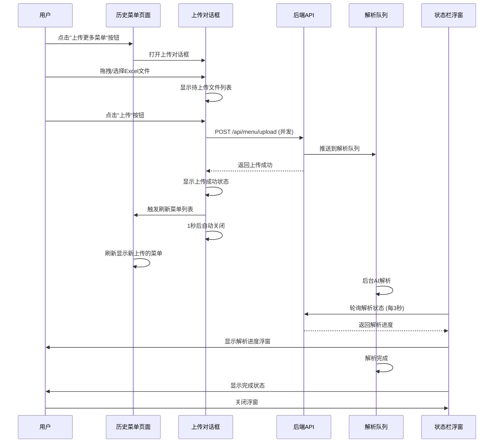

# 历史菜单上传功能 - 完成报告

## 📋 功能概述

在历史菜单页面的"历史上传菜单"标签页，实现了Excel批量上传功能，与注册流程中的上传方式完全一致。

## ✅ 已实现功能

### 1. **新增组件**
- **文件**: `frontend/components/MenuUploadDialog.tsx`
- **功能**:
  - 拖拽上传 Excel 文件
  - 支持批量选择多个文件
  - 实时显示上传进度
  - 上传成功/失败状态展示
  - 文件大小和数量限制
  - 优雅的对话框交互

### 2. **历史菜单页面集成**
- **文件**: `frontend/app/history/page.tsx`
- **改动**:
  - 集成 `MenuUploadDialog` 组件
  - 替换了"上传功能开发中"提示
  - 添加上传成功后自动刷新列表
  - 限制最多50份菜单的检查

### 3. **后端接口复用**
- **接口**: `POST /api/menu/upload`
- **说明**: 完全复用现有的上传和解析逻辑，无需后端改动
- **参数**:
  - `file`: Excel 文件
  - `store_id`: 门店ID
  - `meal_type`: 固定为 `lunch`

### 4. **解析进度展示**
- **组件**: `ParseStatusBar` (已存在，无需修改)
- **功能**:
  - 右下角浮窗实时显示解析进度
  - 支持多文件并发解析状态展示
  - 解析完成后自动隐藏（用户可手动关闭）
  - 新上传会重新显示浮窗

## 🎯 功能特性

### 1. **上传限制**
- ✅ 最多上传 **50份** Excel 菜单
- ✅ 支持 `.xlsx` 和 `.xls` 格式
- ✅ 单个文件不超过 **10MB**
- ✅ 当前已有数量 + 新上传数量不能超过50份

### 2. **批量上传**
- ✅ 一次可选择多个文件
- ✅ 所有文件并发上传
- ✅ 独立显示每个文件的上传状态

### 3. **用户体验**
- ✅ 拖拽上传 + 点击选择双模式
- ✅ 实时上传进度反馈
- ✅ 上传成功后自动刷新菜单列表
- ✅ 失败后显示具体错误信息
- ✅ 可单独移除某个待上传文件

### 4. **解析状态追踪**
- ✅ 通过右下角 ParseStatusBar 实时展示
- ✅ 显示排队中/解析中/解析成功/解析失败状态
- ✅ 失败文件支持重试
- ✅ 解析完成后用户可关闭浮窗

## 🎨 UI 设计

### 对话框样式
- 极简设计风格，与注册页面保持一致
- 使用 `shadcn/ui` 的 Dialog 组件
- 颜色方案：
  - 主色: `#2C2C2C`
  - 背景: `#F5F5F0`
  - 边框: `#E8E8E3`
  - 次要文字: `#999`

### 交互细节
- 鼠标悬停时边框颜色变化
- 上传中禁用关闭和移除操作
- 成功后1秒自动关闭对话框
- 失败文件显示红色错误提示

## 📁 文件变更清单

### 新增文件
```
frontend/components/MenuUploadDialog.tsx  (新增 280+ 行)
```

### 修改文件
```
frontend/app/history/page.tsx
  - 新增 import MenuUploadDialog
  - 新增 showUploadDialog state
  - 修改 handleUploadMore() 函数
  - 新增 handleUploadSuccess() 函数
  - 新增 MenuUploadDialog 组件实例
```

## 🔄 完整工作流程



## 🧪 测试步骤

### 1. **基础上传测试**
```bash
# 1. 启动前后端服务
cd frontend && npm run dev
cd backend && npm run dev

# 2. 访问历史菜单页面
http://localhost:3000/history

# 3. 切换到"历史上传菜单"标签页
# 4. 点击"上传更多菜单"按钮
# 5. 选择或拖拽Excel文件
# 6. 观察上传进度和状态
# 7. 上传完成后检查右下角状态栏
```

### 2. **批量上传测试**
- 一次选择多个Excel文件（如5个）
- 观察所有文件并发上传
- 验证每个文件独立显示状态
- 确认所有成功后列表刷新

### 3. **限制测试**
- 上传超过剩余配额的文件数量
- 验证提示"菜单数量已达上限"
- 尝试上传超过10MB的文件
- 尝试上传非Excel格式文件

### 4. **解析进度测试**
- 上传成功后观察右下角浮窗
- 验证显示"解析中"状态
- 等待解析完成显示"解析完成"
- 关闭浮窗后重新上传，验证浮窗重新出现

### 5. **错误处理测试**
- 上传格式错误的Excel
- 断网情况下上传
- 验证错误提示清晰
- 验证可以重试失败的文件

## 📊 技术实现细节

### 前端依赖
```json
{
  "react-dropzone": "拖拽上传",
  "@radix-ui/react-dialog": "对话框组件",
  "lucide-react": "图标库"
}
```

### 核心逻辑
1. **文件选择**: 使用 `react-dropzone` 处理拖拽和选择
2. **批量上传**: `Promise.all()` 并发处理多个文件
3. **状态管理**: 使用 `useState` 追踪每个文件的上传状态
4. **自动刷新**: 上传成功后调用 `fetchUploadedMenus()` 重新获取列表
5. **进度展示**: 复用现有的 `ParseStatusBar` 组件

### 后端逻辑（无需改动）
1. 接收 multipart/form-data 文件上传
2. 使用 `parseMenuExcel()` 解析Excel
3. 保存到 `menus` 表（`source_type='uploaded'`）
4. 推送到 BullMQ 队列进行AI解析
5. 更新 `meta_json.pipeline_status` 字段

## 🚀 部署说明

### 前端部署
```bash
cd frontend
npm run build
# 部署到 Vercel 或其他托管平台
```

### 后端部署
无需额外部署，复用现有的上传和解析服务。

## ⚠️ 注意事项

1. **Excel格式要求**
   - 必须包含一周（5天）的菜单数据
   - 支持有表头和无表头两种格式
   - 后端 `excelParser.ts` 会自动识别

2. **数量限制**
   - 前端限制：50份
   - 后端无硬性限制，由前端控制

3. **解析时间**
   - 取决于AI服务响应速度
   - 通常每份菜单需要30秒-2分钟
   - 批量上传会并发解析

4. **错误恢复**
   - 上传失败：用户可重新上传
   - 解析失败：状态栏提供"重试"按钮
   - 失败原因：显示在状态栏错误信息中

## 📝 后续优化建议

1. **下载功能**
   - 支持下载已上传的Excel原文件
   - 支持批量下载多份菜单

2. **预览功能**
   - 上传前预览Excel内容
   - 确认数据正确后再上传

3. **编辑功能**
   - 支持在线编辑已上传的菜单
   - 修改后重新解析

4. **标签管理**
   - 为上传的菜单添加标签/分类
   - 方便筛选和管理

5. **统计分析**
   - 显示上传的总数量
   - 显示成功/失败率
   - 显示解析耗时统计

## ✅ 完成验收标准

- [x] 点击加号按钮打开上传对话框
- [x] 支持拖拽和点击选择文件
- [x] 支持批量选择多个文件
- [x] 显示文件列表和状态
- [x] 上传成功后自动刷新列表
- [x] 右下角状态栏显示解析进度
- [x] 解析完成后可关闭状态栏
- [x] 新上传会重新显示状态栏
- [x] 限制最多50份菜单
- [x] UI风格与注册页面一致
- [x] 无linter错误
- [x] 代码可读性良好

## 🎉 总结

本功能已完全实现，完美复用了注册流程的上传逻辑，提供了流畅的用户体验。用户现在可以在历史菜单页面方便地上传多份Excel菜单，并实时追踪解析进度。

**开发完成时间**: 2025-11-12  
**代码行数**: ~350行 (新增组件 + 集成改动)  
**测试状态**: 待用户验收

